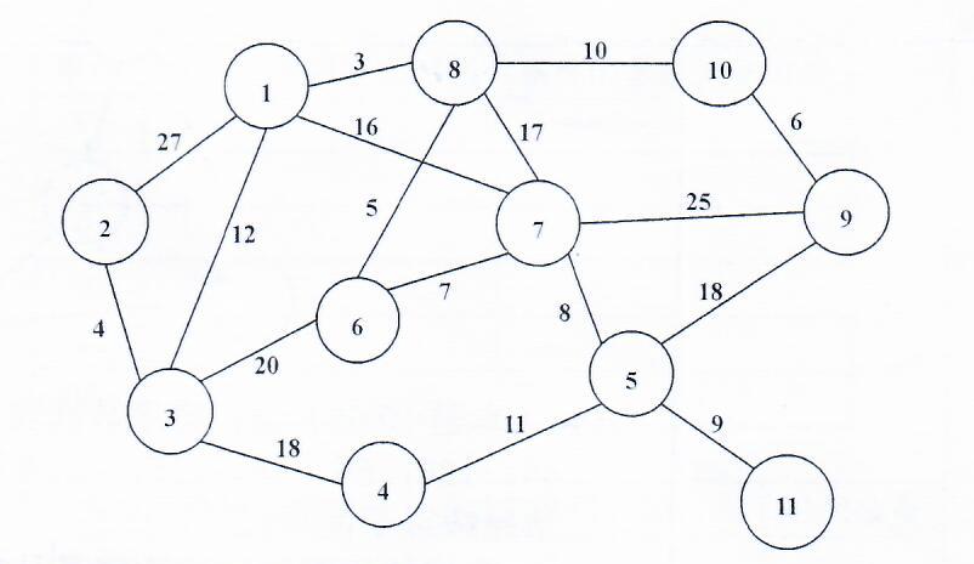
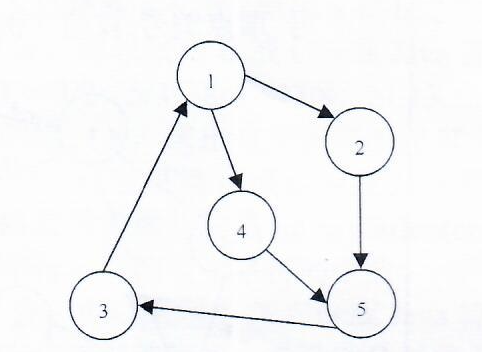
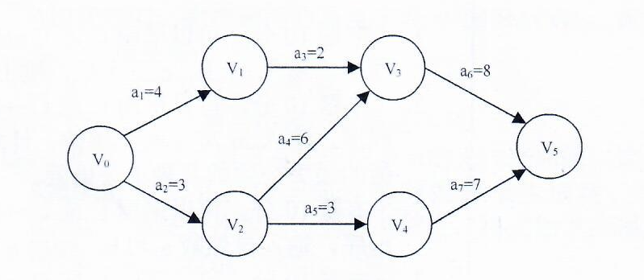

> 可以使用C、C++或Java答题

1、编写一个程序，输入`a、b、c`三个值，输出其中最大值。

2、编写一个程序，输入`m`与`n`两个整数，计算并输出`m`与`n`的绝对值的最大公约数及最小公倍数。

3、编写一个程序，输入自然数`a`和`b`，输出`a`和`b`之间的素数。

4、有一分数序列：`2/1,3/2,5/3,8/5,13/8,21/13...`请编写程序，根据用户输入的`N`，求出这个数列的前`N`项之和。

5、定义一个计算字符串有效长度的函数`int MyStrlen(char *str)`，其功能是统计字符串中的英文字符的个数。

6、编写一个采用递归方式实现的程序，其功能是对输入的一个以`.`结束的字符串，进行反序输出。

7、学者A去国外留学，假定离开祖国的日子为公元`A年B月C日`，返回的日子为公元`X年Y月Z日`。请计算A出国留学的总天数（含离开和返回当天）。

8、输入两个`有序数列`，设计算法将二者合并成一个`有序数列`。

9、有`n`人围成一圈，顺序排号。现在从第`i`个人开始，由`1`至`k`不断报数，凡报到k的人出列。重复报数的过程，直到所有人都出列为止。请编写程序模拟这`n`个人出列的顺序。

10、已知某二叉树的前序遍历的节点序列为`ABDFCEG`，中序遍历的节点序列为`DFBACGE`，请完成以下两项任务：
1. 画出该二叉树的示意图；
2. 给出该二叉树的后序遍历的节点序列。

11、假设有如下图所示的无向连通网。请使用`Kruskal`算法获得该无向连通图的最小生成树，写出`Kruskal`算法依次挑选出的及权值，格式如下：`顶点编号-顶点编号:权值`（例如：① - ② : 27）。

12、关键码集合为`{15, 7, 22, 18, 3, 11, 26, 16, 24, 29}`,散列表表长为13，散列函数为`H(key) = key mod 13`，用线性探测法处理冲突，请按照关键码的给定次序，在如下散列表中填入相应关键码，并计算查找成功情况下，这组关键码的平均查找长度（ASL）。

|散列地址|0|1|2|3|4|5|6|7|8|9|10|11|12|
|----|----|----|----|----|----|----|----|----|----|----|----|----|----|
|关键码| | | | | | | | | | | | | | |

13、给定如下所示的有向图，请完成以下四项任务：

1. 给出该有向图的邻接表；
2. 给出该有向图的邻接矩阵；
3. 从顶点`1`开始，给出该有向图所有可能的广度优先遍历序列。

14、设待排序数据表`T=(90, 50, 80, 70, 12, 44, 120, 66, 88, 135)`。如果要从小到大排列这组数据，请完成以下两项任务；

1. 若相邻元素的比较次序是从前往后依次进行的，给出冒泡排序算法第一趟排序后的结果。
2. 如果以第一个数据`90`作为基准点，给出快速排序算法第一次划分后的结果。

15、设有如下AOE（边表示活动）网络，请填写以下两个表格，并写出该AOE网络中所有关键活动。

|事件|事件的最早开始时间|事件的最迟开始时间|
|----|----|----|
|$$V_0$$|||
|$$V_1$$|||
|$$V_2$$|||
|$$V_3$$|||
|$$V_4$$|||
|$$V_5$$|||

|活动|活动的最早开始时间|活动的最迟开始时间|时间余量|
|----|----|----|----|
|$$a_0$$||||
|$$a_1$$||||
|$$a_2$$||||
|$$a_3$$||||
|$$a_4$$||||
|$$a_5$$||||
|$$a_6$$||||
|$$a_7$$||||
